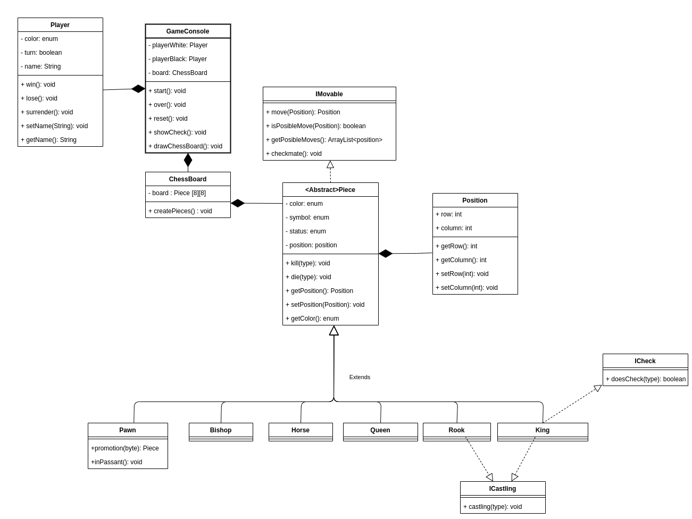

## Chess

### Trello
[Trello](https://trello.com/b/N2tGKCSu/chess)

### Class diagram

### Objective: 
Create a program that allows interaction of two users to play Chess.

### Details:

- [ ] The user interaction will be through the command line.
- [ ] To send the instruction to move a piece it is needed to send this format:  
- S(2a)T(3a) -> that means Source(row: 2 , column:a)to Target(row:3, column:a)

- [ ] User interaction through UI
- [ ] A piece can be moved just with its allowed behavior (see rules). The result of a movement can destroy a piece, so the board should not display the destroyed ones.
- [ ] The program can return all the possible movements of a specific piece by sending just the position so the program already knows which piece is there. I.e.:    P( 2 a) - > should return ( 3 a) and ( 4 a)
       ▪ P( 1 a) - > should return none
       
- [ ] The program will notify when there is possible checkmate. See rules for more information
- [ ]The program will stop automatically when there is a checkmate and proper
    notification will be displayed to the winner. See rules for more information.
- [ ] Promotion When a pawn advances to the eighth rank, as a part of the move it is promoted and must be exchanged for the player's choice of queen, rook, bishop, or knight of the same color
- [ ] The program should have the ability to restart the game to the initial state at any time.
- [ ] The program should let the user choose the side of the black/white pieces (top/bottom)

----

## Rules:

### Initial state:

### Initial position:

*  first (bottom) row: rook, knight, bishop, queen, king, bishop, knight, and rook;
* second row: pawns

**Details of each piece:**

* R - > rook
* B -> bishop
* H -> horse
* Q - > queen
* K - > king
* P - > pawn

**Color:**

* RB -> rook black; RW - > rook white
* HB - > horse black; HW - > horse white
* BB - > bishop black; BW - > bishop white
* QB - > queen black; QW - > queen white
* KB - > king black; KW - > king white
* pB - > pawn black; pW - > pawn white

**Movements:**

Each piece has its own may of moving as follows:

**Source**: wikipedia

- The king moves one square in any direction. The king also has a special move called _castling_ that involves also moving a rook.  
- A rook can move any number of squares along a rank or file, but cannot leap over other pieces. Along with the king, a rook is involved during the king's castling move.  
- A bishop can move any number of squares diagonally, but cannot leap over other pieces.  
- The queen combines the power of a rook and bishop and can move any number of squares along a rank, file, or diagonal, but cannot leap over other pieces.  
- A knight moves to any of the closest squares that are not on the same rank, file, or diagonal. (Thus the move forms an "L"-shape: two squares vertically and one square horizontally, or two squares horizontally and one square vertically.) The knight is the only piece that can leap over other pieces.  
- A pawn can move forward to the unoccupied square immediately in front of it on the same file, or on its first move it can advance two squares along the same file, provided both squares are unoccupied (black dots in the diagram); or the pawn can capture an opponent's piece on a square diagonally in front of it on an adjacent file, by moving to that square (black "x"s). A pawn has two special moves: the _en passant_ capture and promotion.  

**Special Cases:**

There is special behavior that just few pieces can do:

* "Castling"  -> pieces involved: King and Rook
* "Promotion" and “en passant” -> just the pawn
* "Check" -> just the King

### More info here.

**End of the game**

**Win:**

Games can be won in the following ways:

**✓ Checkmate :** The player whose turn it is to move is in check and has no legal move to escape check.  
**✓ Resignation :** Either player may resign, conceding the game to the opponent.  
**✓ Win on time :** In games with a time control, a player wins if the opponent runs out of time, even if the opponent has a superior position, as long as the player has a theoretical possibility to checkmate the opponent.  
**✓ Forfeit :** A player who cheats, violates the rules, or violates the rules of conduct specified for the particular tournament, can be forfeited  

**Draw** :

There are several ways games can end in a draw:

* Draw by agreement
* Stalemate
* Threefold repetition
* Fifty-move rule
* Dead position
* Draw on time

More info here.
